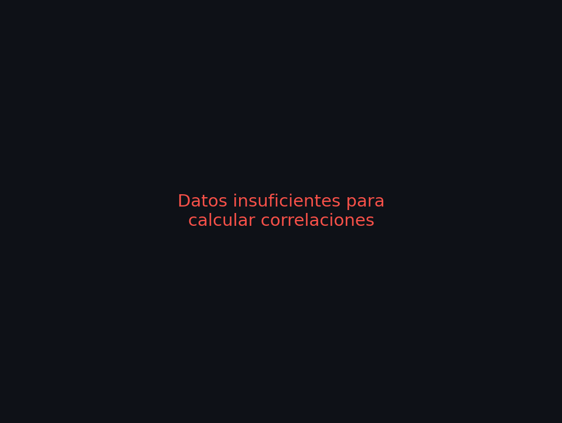
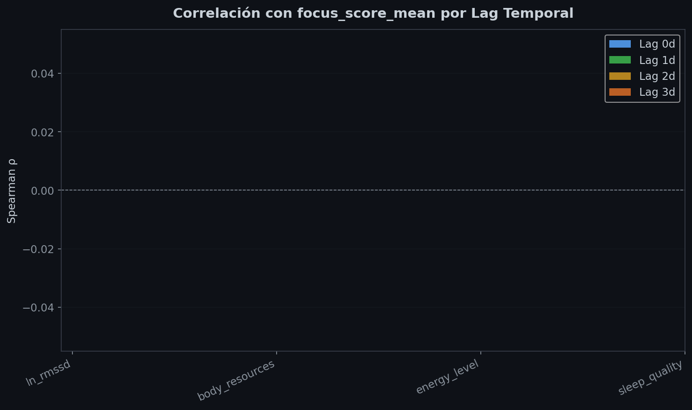
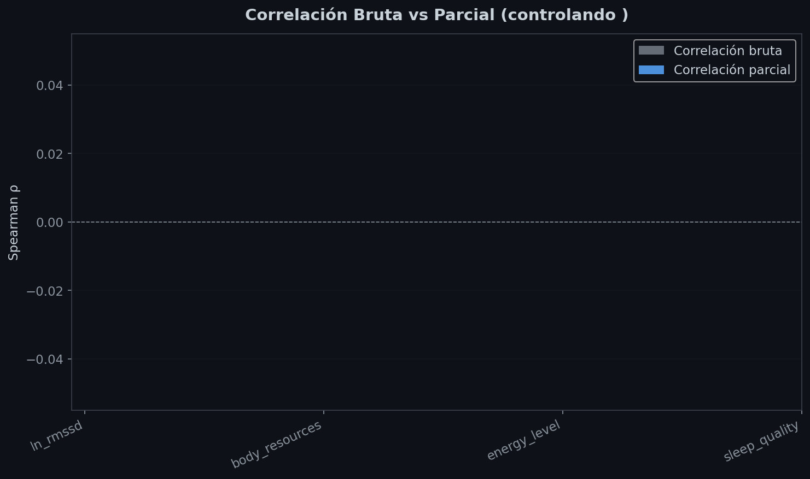
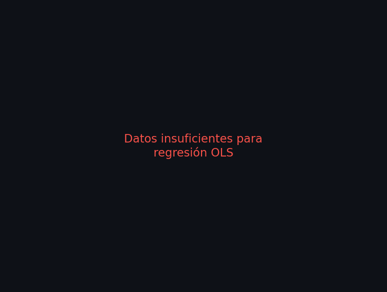
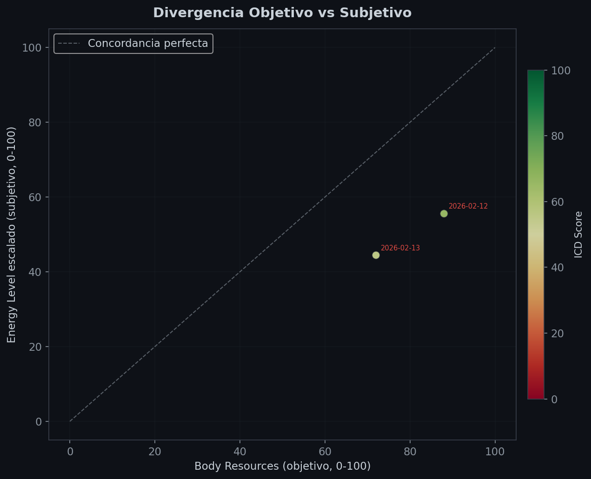

# Reporte de Análisis de Correlación Semanal

**Generado:** 2026-02-13 16:43
**Rango de datos:** 2026-01-31 → 2026-02-13 (14 días)

---

## Advertencias

- Solo hay 14 días de datos (mínimo recomendado: 30). Las correlaciones pueden no ser significativas.
- Columna 'energy_level' tiene 86% valores nulos — resultados poco fiables.
- Columna 'mental_clarity' tiene 86% valores nulos — resultados poco fiables.
- Columna 'focus_score_mean' tiene 100% valores nulos — resultados poco fiables.
- No hay sesiones de estudio registradas (focus_score). Los análisis de correlación con rendimiento no son posibles.
- 2 días (100%) con divergencia objetivo-subjetivo > 25 puntos.

---

## 1. Matriz de Correlación (Spearman)

---

## 2. Análisis de Lag Temporal

### Coeficientes por Feature y Lag

| Feature | Lag 0 | Lag 1 | Lag 2 | Lag 3 |
|---------|-------|-------|-------|-------|
| ln_rmssd | — | — | — | — |
| body_resources | — | — | — | — |
| energy_level | — | — | — | — |
| sleep_quality | — | — | — | — |

---

## 3. Correlación Parcial (controlando confounders)

### Bruta vs Parcial

| Feature | r bruta | r parcial | Δ |
|---------|---------|-----------|---|
| ln_rmssd | — | — | — |
| body_resources | — | — | — |
| energy_level | — | — | — |
| sleep_quality | — | — | — |

---

## 4. Validación de Pesos ICD (Regresión OLS)

---

## 5. Divergencia Objetivo vs Subjetivo

> **Hallazgo:** 2 días (100%) con divergencia objetivo-subjetivo > 25 puntos.

---

## Conclusiones Automáticas

