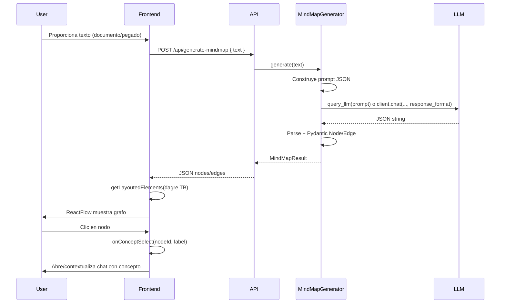

# Especificación: Mapas Mentales Semánticos (Knowledge Graphs)

Dialektos — Transformación de texto no estructurado en grafos visuales interactivos para estudio.

---

## 1. Estructura JSON de respuesta del backend

El endpoint `POST /api/generate-mindmap` devuelve un JSON con la siguiente estructura.

### Campos

- **`nodes`**: array de nodos. Cada elemento tiene:
  - `id` (string): identificador único del nodo (no vacío).
  - `label` (string): texto mostrado (concepto o tema).
  - `type` (string): tipo del nodo; valores recomendados: `"concept"`, `"topic"`, `"detail"`.

- **`edges`**: array de aristas. Cada elemento tiene:
  - `source` (string): `id` del nodo origen.
  - `target` (string): `id` del nodo destino.
  - `relation` (string): descripción breve de la relación semántica.

- **`metadata`** (opcional): trazabilidad, por ejemplo:
  - `source_text_length` (int): longitud del texto de entrada.
  - `model_used` (string): modelo LLM utilizado.

### Ejemplo

```json
{
  "nodes": [
    { "id": "n1", "label": "Integral definida", "type": "concept" },
    { "id": "n2", "label": "Teorema fundamental del cálculo", "type": "concept" },
    { "id": "n3", "label": "Primitiva", "type": "concept" }
  ],
  "edges": [
    { "source": "n1", "target": "n2", "relation": "se fundamenta en" },
    { "source": "n2", "target": "n3", "relation": "relaciona con" }
  ],
  "metadata": {
    "source_text_length": 2500,
    "model_used": "gpt-4o-mini"
  }
}
```

---

## 2. Firma de la clase Python `MindMapGenerator`

### Módulo

`src/brain/mindmapper.py`

### Modelos Pydantic

- **`Node`**
  - `id: str` (min_length >= 1)
  - `label: str` (min_length >= 1)
  - `type: str` (p. ej. restringido a `"concept"`, `"topic"`, `"detail"`)

- **`Edge`**
  - `source: str` (min_length >= 1)
  - `target: str` (min_length >= 1)
  - `relation: str` (min_length >= 1)

- **`MindMapResult`**
  - `nodes: List[Node]`
  - `edges: List[Edge]`
  - `metadata: Optional[Dict[str, Any]]` (opcional)

### Clase `MindMapGenerator`

- **Constructor**: `__init__(self, llm_callable: Optional[Callable[..., str]] = None)`
  - Si `llm_callable` es `None`, se usa `query_llm` de `src.brain.llm_client`.

- **Método**: `generate(self, text: str) -> MindMapResult`
  - Recibe el texto del documento.
  - Construye un prompt de sistema que exige **solo** un JSON válido con `nodes` y `edges`.
  - Llama al LLM (o a `llm_callable`) y parsea la respuesta a `MindMapResult` vía Pydantic.
  - Opcional: usar el cliente OpenAI con `response_format` para JSON estructurado.

---

## 3. Componentes React y estado

### Componente principal

`apps/dashboard/components/mind-map-view.tsx` — `MindMapView`

### Estado

- **`nodes`** / **`edges`**: en formato ReactFlow (`Node[]`, `Edge[]` de `reactflow`), tras convertir la respuesta del API y aplicar el layout.
- **`loading`**: boolean, petición a `/api/generate-mindmap` en curso.
- **`error`**: `Error | null`, error de la petición.
- **`selectedConcept`** (opcional): `{ nodeId: string; label: string } | null` para el flujo “chatear con este concepto”.

### Flujo de datos

- Función **`generateMindmap(text: string)`**: llama a `api.generateMindmap(text)`, recibe el JSON, convierte a nodos/aristas ReactFlow, aplica **`getLayoutedElements(nodes, edges)`** con **dagre** (orientación **Top-to-Bottom**) y actualiza el estado para que ReactFlow renderice.

### Integración con chat

- **`onNodeClick`** en ReactFlow invoca un callback **`onConceptSelect?(nodeId: string, label: string)`**.
- La página o contenedor puede usar este callback para abrir/focalizar el chat con un mensaje inicial tipo “Explica este concepto: [label]” o inyectar el concepto en el contexto.

---

## 4. Diagrama de secuencia (Mermaid)



Flujo resumido:

1. Usuario/sistema proporciona texto (p. ej. documento ya procesado o pegado).
2. Frontend envía `POST /api/generate-mindmap` con `{ "text": "..." }`.
3. Backend: `MindMapGenerator.generate(text)` → construye prompt → llama al LLM.
4. Backend: parsea/valida respuesta con Pydantic (Node/Edge) → devuelve JSON.
5. Frontend: recibe JSON → `getLayoutedElements` (dagre, TB) → actualiza estado → ReactFlow pinta el grafo.
6. Usuario hace clic en nodo → `onNodeClick` → callback “chatear con concepto”.
